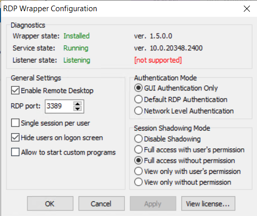

!!!THIS IS AN UNMAINTAINED PROJECT!!!
# RDP Shadow Tracking

##### Introduction:
These 2 scripts were written to monitor employees(users) of a company by the administrator privileged users only without the user knowing. These scripts can both monitor and control the user's desktop environment while the user is logged in over RDP.

A little background... These scripts were written 2 years ago for Windows Server 2017 in powershell. It supports all Windows server version. It has been tested and working on:

* Windows Server 2017
* Windows Server 2022
* Windows Server 2012

[RDP-wrapper](https://github.com/stascorp/rdpwrap) library was installed on the servers as well and will be required to setup privilege escalation for shadow without user prompt.



##### Usage:
Change the following line:
```
$values = "WIN-HM4KMCQEH2D","etc..."
```
Here, `WIN-HM4KMCQEH2D` represents the computer name. Change it to your computer/server's name. Then run it with Windows Powershell.

Here are the basic layout:

**ShadowLogin:** Just login and no control over user. The user doesn't know that you are seeing his screen.(User doesn't know you are breaching his privacy)
**ShadowControl:** You can control the user's desktop. (User knows someone is breaching his privacy)
